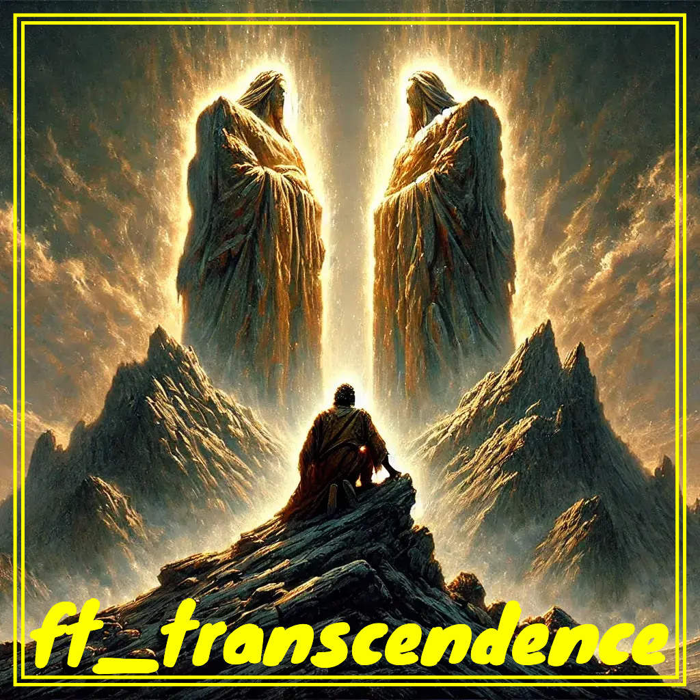

  

## 🚀 SYNOPSIS

`ft_transcendence` is the capstone of 42’s Common Core, challenging students to design a secure, full-stack web application from scratch.

It covers the entire development lifecycle—front-end, back-end, database management, real-time features, and security—using modern technologies and frameworks.

Beyond technical skills, the project emphasizes clean architecture, scalability, teamwork, and real-world software practices.

More than a technical milestone, `ft_transcendence` reflects the 42 ethos: innovation, self-learning, and readiness for the evolving tech landscape.

https://github.com/user-attachments/assets/d413e4fc-fbc1-4276-8cca-855be4e4f7a5

## 🛠️ REPO SPECIFICITIES AND CONSIDERATIONS

---

### 🚀 BACKEND

- **Framework:** Built on **Django**, leveraging its reliability and scalability.
- **Microservices:** The backend is **modularized as microservices**, making it easy to scale and maintain.
- **Database:** Powered by **PostgreSQL**, with the database and its dedicated API running in **separate containers** for improved security and flexibility.
- **API:** A robust **HTTP API** exposes database and game operations for frontend and game clients.
- **Websockets:** Real-time remote play is enabled via **WebSockets**.

---

### 🎨 FRONTEND

- **SPA with HTMX:** Although we didn’t use a full JS framework, we achieved a **Single Page Application** experience using **HTMX** + **Bootstrap** for dynamic interactions and responsive design.
- **3D Graphics:** The game features both **2D and 3D modes**, using **Three.js** for immersive 3D gameplay and skins.
- **Multi-Language Support:** The interface supports **multiple languages**, aiming for a wider audience and inclusivity.

---

### 🔒 SECURITY

- **JWT Authentication:** All authentication relies on **JWT tokens**.
- **Google 2FA:** Integrated **Google Two-Factor Authentication** for enhanced account security.
- **Session Uniqueness:** When a user logs in from a new device, their previous session (if active) is disconnected if any action is taken, thanks to a **UUID connection token embedded in the JWT payload**.

---

### 🎮 GAME & TOURNAMENTS

- **Classic Pong, Reimagined:** Play the timeless Pong—now with additional features!
- **Local & Remote Play:** Play against opponents on the same device or remotely via the internet.
- **Multiple Tournaments:** Host and participate in **multiple tournaments** with a blend of local and remote players.
- **2D/3D Choice:** Each client can choose to play in either **2D or 3D mode** independently.
- **Game Customization:** Unlock and use **various skins** and personalizations for the game.
- **Server-Side Pong:** All game logic and state are managed server-side via a robust API.

---

### 👥 USER MANAGEMENT and STATS

- **Profiles:** Every user has a personal profile with full stats and customization options.
- **Stats:** Track wins, losses, tournaments, and more—**live statistics** for both users and games.

---

### ✨ EXTRA FEATURES

- **SPA without a JS Framework:** Achieved a dynamic, interactive SPA experience with **HTMX** instead of a full JavaScript framework.
- **Microservice Database:** Database and its API are **containerized separately** for security and architectural clarity.
- **Advanced Session Management:** Seamless session handling prevents account hijacking across devices.
- **Fully Customizable Tournaments:** Mix and match remote/local players, with flexible game modes and instant switching between 2D and 3D.

---

### 🛠️ GLOBAL TECH STACK:

- **Backend:** Django, PostgreSQL, WebSockets, Docker, FastAPI, NGINX
- **Frontend:** HTMX, Bootstrap, Three.js, CSS, HTML
- **Auth & Security:** JWT, Google 2FA
- **Orchestration:** Docker Compose

### 🧑‍💻 Authors:
- **Dan SYLVAIN** ([@dsylvain](https://github.com/dansylvain)) – Responsible for the Front-End development. Built a solid logic for achieving the SPA, with a skilful blend of HTMX, JS, HTML and CSS.
- **Sébastien VIDOT** ([@svidot](https://github.com/sierra182)) – Built the game logic from scratch in pure JS. Also developped the **Remote Players** feature, and managed to run tournaments seamlessly.
- **Florian VERGE** ([@flverge](https://github.com/maitreverge)) – Focused on creating database core logic and its API. Also built the authentication whole process, from the register/login pages to the JWT and 2FA.
- [@pf4](https://github.com/elydre) - Built the 3D game engine, and its seamlessly integration to the game API and the rest of the infrastructure. Made game customizations and some POV controls, both exclusive to the 3D engine.

