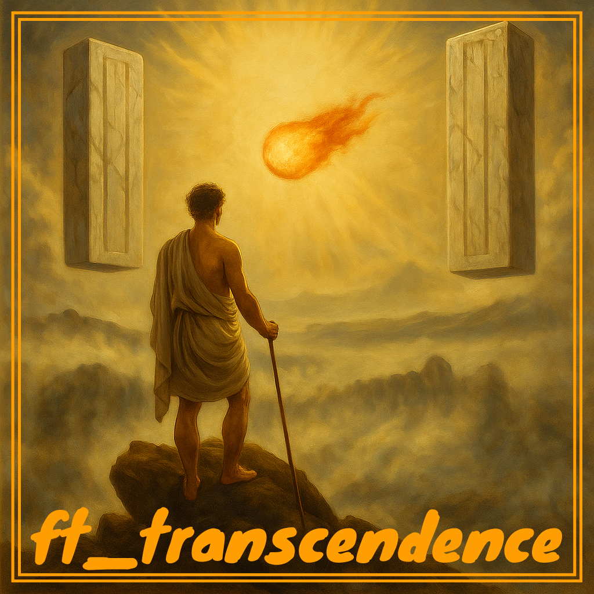

  

## 🚀 SYNOPSIS

`ft_transcendence` represents the pinnacle of 42's Common Core curriculum : a capstone project that fuses creativity, technical mastery, and cutting-edge web development.

This project challenges students to build a fully functional and secure web application, embodying the principles of full-stack development. It spans the entire software lifecycle, encompassing front-end, back-end, database management, real-time functionalities, and robust security practices.

https://github.com/user-attachments/assets/d413e4fc-fbc1-4276-8cca-855be4e4f7a5

Students employ modern web technologies and frameworks, including **(determine webstack here)**, to construct a dynamic, responsive, and user-friendly application. The project goes beyond technical implementation by introducing students to concepts such as authentication, authorization, and real-time communication using WebSockets.

`ft_transcendence` pushes students to achieve excellence in software engineering. They must balance clean code architecture, modularity, and scalability while meeting demanding functional and non-functional requirements. Collaboration, a core element of this project, mirrors real-world software team environments, fostering teamwork and project management skills.

More than a technical exercise, ft_transcendence embodies the 42 philosophy: a relentless pursuit of innovation, self-learning, and mastery. Completing this project equips students with the knowledge and confidence to excel in modern software development and navigate the complex landscape of the tech industry.

## 🛠️ REPO SPECIFICITIES AND CONSIDERATIONS

Project In Progress...
